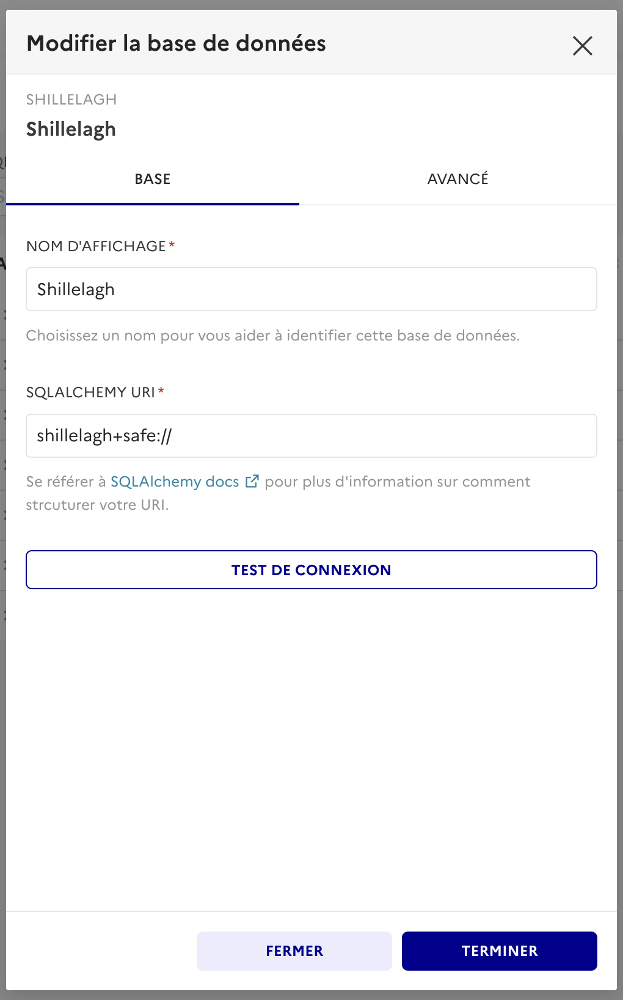
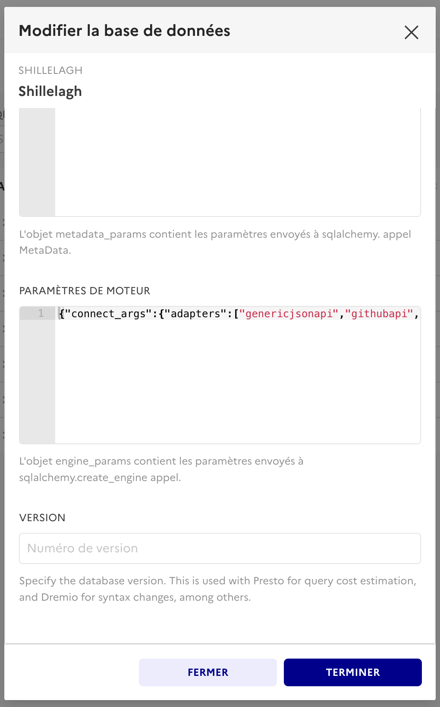
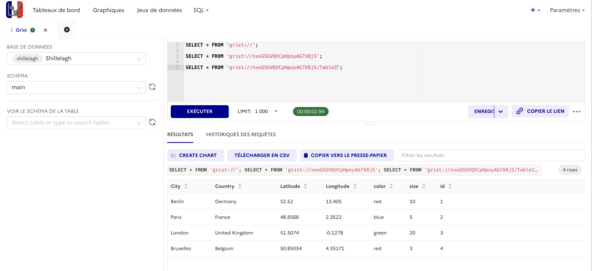

# shillelagh-gristapi

A **[Shillelagh](https://github.com/betodealmeida/shillelagh) adapter** for the [Grist REST API](https://support.getgrist.com/api/).  
It lets you query Grist documents and tables with **SQL** via SQLite/SQLAlchemy,  
ideal for BI tools like [Apache Superset](https://superset.apache.org/).

---

## ✨ Features

- Query Grist documents, tables, and records as if they were **SQL tables**
- Supports core SQL operations:
  - `SELECT` statements on Grist tables
  - Filter pushdown for `=` condition
  - Server-side sorting and `LIMIT`
- Built-in discovery helpers:
  - `grist://` → list all documents
  - `grist://<doc_id>` → list tables in a document
  - `grist://<doc_id>/<table_id>` → query rows in a table
- Flexible usage:
  - **CLI**: via the `shillelagh` shell or `python -m shillelagh_gristapi ...`
  - **Python**: connect directly with the `connect()` API
  - **Superset**: drop-in integration for dashboards
- **Enforces Grist access rules**:  
  Your Grist permissions carry over automatically.  
  If you can only see certain tables, columns, or rows in Grist,  
  you’ll see exactly the same restrictions through this adapter.

---

## 🚀 Installation

```bash
pip install shillelagh-gristapi
# CLI
pip install 'shillelagh[console]'
```

Or from source:

```bash
git clone https://github.com/qleroy/shillelagh-gristapi.git
cd shillelagh-gristapi
pip install -e .[dev]
```

---

## ⚙️ Configuration
You need a Grist API key. 
- Fin doou `API_KEY` in your profile settings. See [Grist docs](https://support.getgrist.com/rest-api/).
- Find your `ORG_ID`  with the [orgs endpoint](https://support.getgrist.com/api/#tag/orgs/operation/listOrgs), e.g. curl -H "Authorization: Bearer <replace-with-your-apy-key> "<replace-with-your-server>/api/orgs/" | jq '.[]|.id',

```yaml
gristapi:
  api_key: ${API_KEY} 
  org_id: ${ORG_ID} 
  server: ${SERVER} # e.g. https://docs.getgrist.com
```

---

## 🧑‍💻 Usage

### 🖥️ CLI

Default configuration in `~/.config/shillelagh/shillelagh.yaml`:

```bash
$ shillelagh
# List document ids
# https://support.getgrist.com/api/#tag/workspaces/operation/listWorkspaces
SELECT * FROM 'grist://';

# List table ids
# https://support.getgrist.com/api/#tag/tables/operation/listTables
SELECT * FROM 'grist://<replace-with-a-doc-id>';

# Fetch records
# https://support.getgrist.com/api/#tag/records
SELECT * FROM 'grist://<replace-with-a-doc-id>/<replace-with-a-table-id>';
```

### 🐍 Python

```python
import os

from shillelagh.backends.apsw.db import connect

connection = connect(
    ":memory:",
    adapter_kwargs={
        "gristapi": {
            "api_key": os.environ["GRIST_API_KEY"],
            "org_id": os.environ["GRIST_ORG_ID"],
            "server": os.environ["GRIST_SERVER"],
        }
    },
)
cursor = connection.cursor()

# List document ids
# https://support.getgrist.com/api/#tag/workspaces/operation/listWorkspaces
query_docs = "SELECT * FROM 'grist://';"
cursor.execute(query_docs).fetchall()

# List table ids
# https://support.getgrist.com/api/#tag/tables/operation/listTables
query_tables = "SELECT * FROM 'grist://<replace-with-a-doc-id>';"
cursor.execute(query_tables).fetchall()

# Fetch records
# https://support.getgrist.com/api/#tag/records
query = "SELECT * FROM 'grist://<replace-with-a-doc-id>/<replace-with-a-table-id>';"
cursor.execute(query).fetchall()
```

### 📊 Apache Superset

- Install `shillelagh` + this adapter in your Superset image;
- Add a Shillelagh database with URI
```
shillelagh+safe://
```
- Configure the engine parameters
```json
{
  "connect_args":
    {
      "adapters":
        ["gristapi"],
      "adapter_kwargs":
        {
          "gristapi":{
            "api_key": "<REPLACE_WITH_YOUR_API_KEY>",
            "org_id": "<REPLACE_WITH_YOUR_ORD_ID>",
            "server": "<REPLACE_WITH_YOUR_SERVER_URL>",
          }
        }
    }
}
```
- Create a virtual dataset using a Grist URI, e.g.:
```sql
select * from 'grist://<doc-id>/<table-id>'
```

| SqlAlchemy URI | Engine parameters |
| --- | --- |
| |  | 

| SQL Lab |
| -- |
||

--- 

## 📄 License
MIT — see (LICENSE)[/LICENSE].